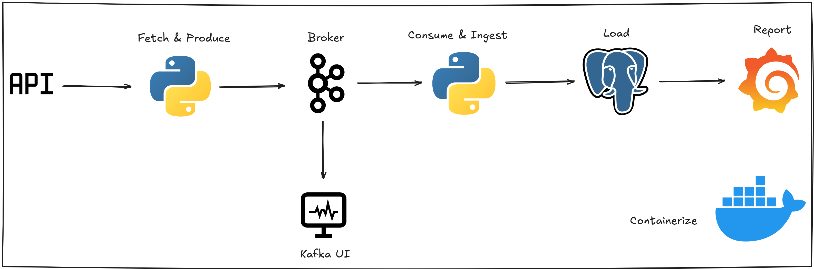

# Realtime Stock Pipeline



A real-time stock price streaming pipeline that fetches market data from Finnhub, streams it through Apache Kafka, and persists it to PostgreSQL.

## Architecture

```
[Finnhub API] → [Producer] → [Kafka + Schema Registry] → [Consumer] → [PostgreSQL]
                                                                    ↓
                                                              [Grafana]
```

- **Producer**: Fetches stock quotes every 10 seconds from Finnhub API and publishes to Kafka
- **Consumer**: Consumes messages from Kafka and ingests them into PostgreSQL
- **Kafka**: Message broker for real-time streaming
- **Schema Registry**: Manages Avro schemas for serialized data
- **PostgreSQL**: Persistent storage for stock quotes
- **Grafana**: Visualization and dashboards
- **Kafka UI**: Web interface for monitoring Kafka topics

## Project Structure

```
realtime-stock-pipeline/
├── assets/                  # Static assets
│   └── pipeline.png        # Architecture diagram
├── init-db/                # Database initialization
│   └── init.sql            # SQL schema for stock_quotes table
├── producer.py             # Fetches stock data from Finnhub and publishes to Kafka
├── consumer.py             # Consumes from Kafka and persists to PostgreSQL
├── compose.yml             # Docker Compose configuration for all services
├── Dockerfile              # Docker image for producer/consumer
├── quote.avsc              # Avro schema for stock quotes
├── pyproject.toml          # Python project configuration
└── .env.example            # Environment variables template
```

## Prerequisites

- Git
- Docker and Docker Compose
- Finnhub API key (free at [finnhub.io](https://finnhub.io))

## Quick Start

1. Clone the repository and navigate to the project directory:

```bash
git clone <repository-url>
cd realtime-stock-pipeline
```

2. Copy the environment file and add your Finnhub API key:

```bash
cp .env.example .env
# Edit .env and set FINNHUB_API_KEY
```

3. Start the entire pipeline:

```bash
docker compose up -d
```

4. Monitor the services:

| Service    | URL                                 |
| ---------- | ----------------------------------- |
| Kafka UI   | http://localhost:8080               |
| Grafana    | http://localhost:3000 (admin/admin) |
| PostgreSQL | localhost:5432                      |

## Configuration

Environment variables can be set in `.env`:

| Variable          | Default      | Description                |
| ----------------- | ------------ | -------------------------- |
| `FINNHUB_API_KEY` | -            | Finnhub API key (required) |
| `KAFKA_TOPIC`     | stock-quotes | Kafka topic name           |
| `DB_HOST`         | postgres     | PostgreSQL host            |
| `DB_PORT`         | 5432         | PostgreSQL port            |
| `DB_USER`         | postgres     | PostgreSQL user            |
| `DB_PASSWORD`     | password     | PostgreSQL password        |
| `DB_NAME`         | stockdb      | PostgreSQL database name   |
| `GF_USER`         | admin        | Grafana username           |
| `GF_PASSWORD`     | admin        | Grafana password           |

## Supported Stocks

The pipeline is configured to track these symbols:

- AAPL (Apple)
- GOOGL (Google)
- MSFT (Microsoft)
- AMZN (Amazon)
- TSLA (Tesla)

To add more symbols, edit the `SYMBOLS` list in `producer.py`.

## Data Schema

Stock quotes are stored with the following fields:

| Field            | Type      | Description           |
| ---------------- | --------- | --------------------- |
| `symbol`         | string    | Stock ticker symbol   |
| `current_price`  | double    | Current trading price |
| `high_price`     | double    | Day high price        |
| `low_price`      | double    | Day low price         |
| `open_price`     | double    | Opening price         |
| `previous_close` | double    | Previous day close    |
| `market_time`    | timestamp | Market timestamp      |
| `fetch_time`     | timestamp | Time data was fetched |

## Troubleshooting

**Check service logs:**

```bash
docker compose logs -f producer
docker compose logs -f consumer
```

**Verify Kafka topics:**

```bash
docker compose exec kafka kafka-topics --list --bootstrap-server localhost:9092
```

**Query the database:**

```bash
docker compose exec postgres-stock psql -U postgres -d stockdb -c "SELECT * FROM stock_quotes;"
```

## Stopping the Pipeline

```bash
docker compose down
```

To also remove volumes (data will be lost):

```bash
docker compose down -v
```
